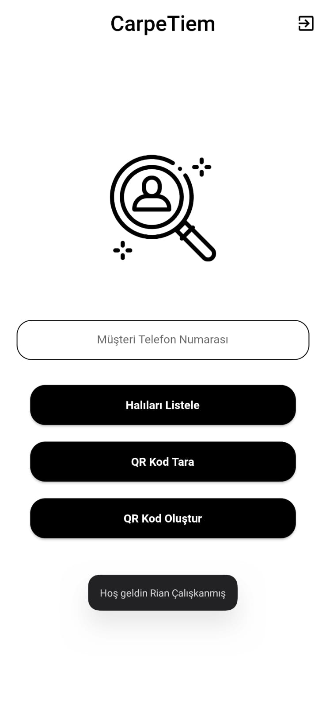
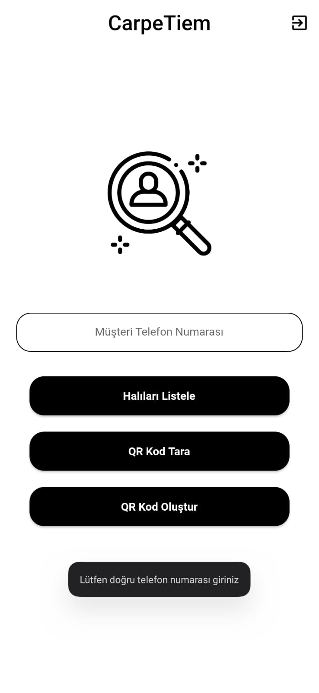
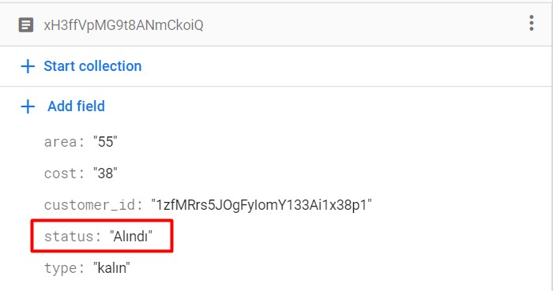
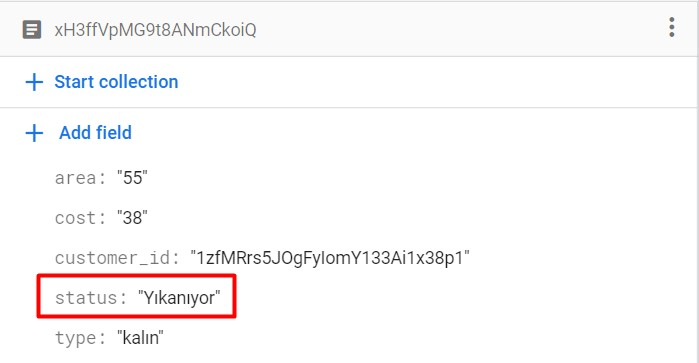

<h1 align="center"> About the Project </h1>

* First of all, the project is still in progress. We are improving our GUI and adding new functionalities to our project.
* This application is more than scanning and generating a QR code. The idea of the project is to provide a tracking and delivery system for carpet cleaning companies and their customers.
* Since project requires both Mobile and Web platforms, I only assigned two people(myself and my friend Rian) from our five member team to Mobile part because most of the work were in Web part.
* Auth system and UI design of the mobile application done by my friend Rian. Rest of the mobile part developed by me.

<h1 align="center"> 
  Login 
</h1>

  
  
   

<h1 align="center"> 
  Home 
</h1>

  
  
  

<h1 align="center"> 
  List Carpets 
</h1>

<h1 align="center"> 
  List Carpets (Save QR Code) 
</h1>

  
   
  

<h1 align="center"> 
  List Carpets (Edit Carpet Status - Tapping to black card) 
</h1>

  
  

<h1 align="center"> 
  Scan QR Code 
</h1>

  
  
  

<h1 align="center"> 
  What happens on Firestore Cloud? 
</h1>

  
  

